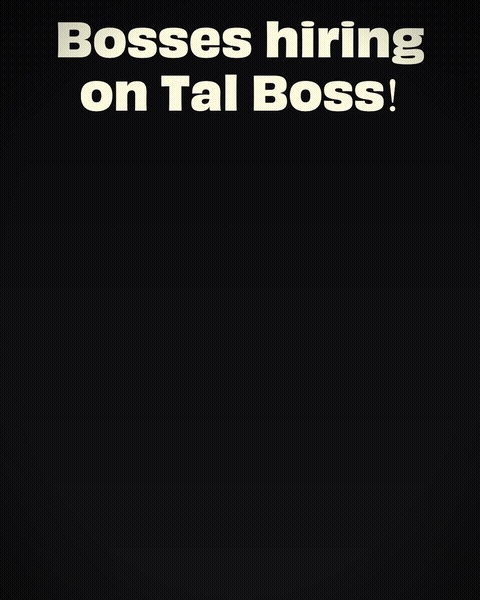

# BOSSES ON TAL — end credit scene

Film-style end-credit slate built with [Remotion](https://remotion.dev). The "BOSSES / ON TAL" title stays locked at the top while a credit crawl of companies + roles rolls underneath. The CTA (app badges + tal BOSS wordmark) rides in as the last block of the crawl and parks in place — the crawl never exits the top.

<p align="center">
  
</p>

Film look: grain + vignette + projection cue mark. No other motion — the crawl is deliberately dead-still and linear.

## Compositions

| ID | Size | FPS | Use |
|---|---|---|---|
| `BossesOnTal` | 1080×1350 (4:5) | 30 | Feed |
| `BossesOnTal-Story` | 1080×1920 (9:16) | 30 | Story / Reel |
| `BossesOnTal-60` | 1080×1350 | 60 | Smooth MP4 |
| `BossesOnTal-Story-60` | 1080×1920 | 60 | Smooth MP4 |

The 60fps comps reuse the 30fps timing via a virtual clock (`vf = frame * CFG.fps / fps`), so all frame values in the config stay authored at 30fps. Duration auto-extends with row count (`calculateMetadata`).

## Quick start

```bash
npm install
npm start          # Remotion Studio
```

## Rendering

```bash
# MP4 (smooth, 60fps)
npx remotion render BossesOnTal-60 out/bosses-on-tal.mp4

# GIF — always from the 30fps comp (browsers clamp GIF frame delays, 60fps GIFs play at 10fps)
npx remotion render BossesOnTal out/bosses-on-tal.gif --codec=gif --every-nth-frame=1

# 720×900 variant = exact 2/3 scale of the 4:5 comp, not a separate comp
npx remotion render BossesOnTal out/bosses-on-tal-720x900.mp4 --scale=0.6666666666666666
```

## Editing

- **All tuning** lives in the `CFG` object in `src/config.ts` (crawl speed, gaps, film-stock intensity, fonts, colors).
- **Credit rows** (company + role) live in `src/data/credits.ts` — add rows and the duration extends automatically.
- **Fonts**: Obviously Wide Bold (title) and Obviously Narrow Bold (credits), demo OTFs included in `public/fonts/`.
